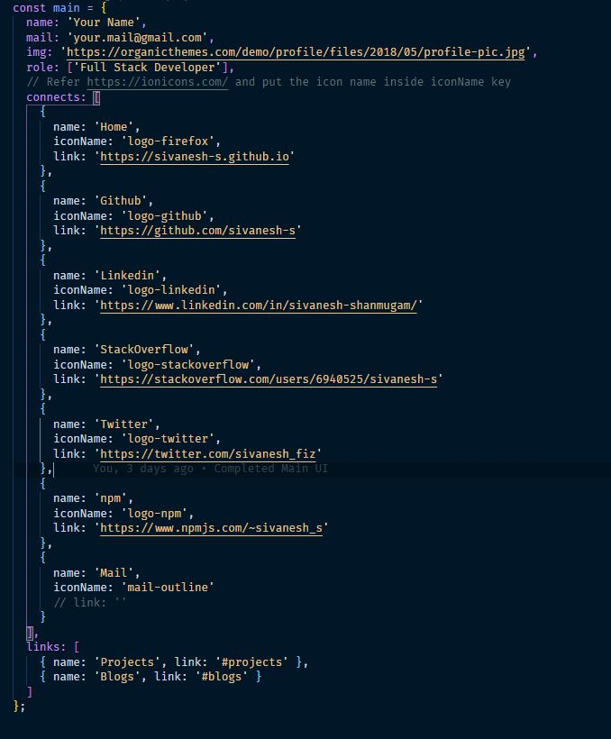

# minimal personal website

## Responsive
It is fully responsive.

## Data for the Portfolio
You don't need to surf through HTML docs and update the data. All the data needed for your portfolio must be updated in `data.js`. (_Right now just for functionality I provided my links. You can change it_)

---
